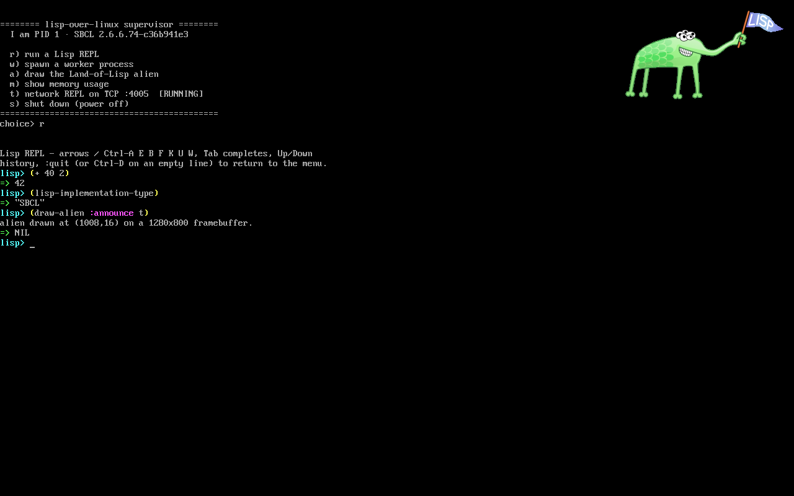

#+TITLE: lisp-over-linux (LoL) — a UEFI laptop that boots straight into SBCL
#+STARTUP: showall

A *very* minimal Linux that a UEFI machine boots directly from a USB stick with
*no bootloader* (the kernel is the EFI application, EFISTUB), whose entire
userland is *SBCL Common Lisp running as PID 1*. No GRUB, no systemd, no shell —
firmware → kernel → Lisp. "lisp-over-linux", LoL for short (yes, also a nod to
the *Land of Lisp* alien this thing paints in the corner of the screen).

/Booted under QEMU/OVMF: SBCL is PID 1 — the supervisor menu, then a colored
REPL session driven on the framebuffer console (default 8x16 font, 160x50).
Screenshots are archived per date under =media/screenshots/=; this link tracks
the latest./

This is a learning project: prefer reading the =.org= docs below over guessing.

* What is in this repo (and what is NOT)

Tracked here: the *sources and docs* — the C preinit, the Lisp supervisor, the
initramfs description, =build.sh=, =deps.sh=, every =.org= write-up, and a pinned
snapshot of the kernel =.config= under =kernel/=.

*NOT* tracked (too big, version-specific, per-machine): the *Linux kernel source
tree* and the *SBCL source tree*. The build reaches them through two *gitignored
symlinks* in the project root:

#+begin_src
  ./linux  ->  a Linux kernel source tree   (e.g. linux-6.18.3)
  ./sbcl   ->  an SBCL source tree (already built)
#+end_src

=build.sh= locates itself and uses =./linux= and =./sbcl= — nothing hardcodes a
home path, so the whole project folder is relocatable and clone-able by anyone.

* Rebuilding the environment from scratch

You need three things present: the two symlinks above (pointing at real trees)
and the host toolchain. Use =deps.sh= to create the symlinks.

** 1. Host packages (Debian/Ubuntu)

#+begin_src sh
  sudo apt install build-essential bc kmod cpio flex bison \
       libncurses-dev libelf-dev libssl-dev dwarves rsync \
       qemu-system-x86 ovmf dosfstools mtools gdisk musl-tools
#+end_src

** 2. The Linux kernel tree  (./linux)

If you ALREADY have a kernel source tree:
#+begin_src sh
  ./deps.sh link linux /path/to/linux-6.18.3
#+end_src

From nothing (downloads into =./sources/=, symlinks, applies our pinned config):
#+begin_src sh
  ./deps.sh kernel 6.18.3      # version defaults to the one we pin in kernel/
#+end_src

The pinned config lives in =kernel/config-6.18.3= (see [[file:doc/kernel-config.org][kernel-config.org]] for what
every option is and why). =deps.sh kernel= copies it to =linux/.config= and runs
=make olddefconfig= for you.

** 3. The SBCL tree  (./sbcl)

If you already have a *built* SBCL checkout:
#+begin_src sh
  ./deps.sh link sbcl /path/to/sbcl
#+end_src

From nothing (clones; you must then build it — SBCL needs an existing Lisp to
bootstrap):
#+begin_src sh
  ./deps.sh sbcl
  cd sbcl && sh make.sh && cd ..
#+end_src

=build.sh= expects =sbcl/src/runtime/sbcl= and =sbcl/output/sbcl.core= to exist.

** 4. Build

#+begin_src sh
  ./deps.sh status        # sanity: both symlinks resolve
  ./build.sh              # preinit + lisp-init + initramfs.cpio   (seconds)
  ./build.sh --kernel     # ALSO rebuild the kernel + BOOTX64.EFI  (minutes)
  ./build.sh --run        # build, boot HEADLESS in QEMU/OVMF, screenshot it
  ./build.sh --interactive  # build, boot in a QEMU WINDOW you can type into
#+end_src

Use =--interactive= (=-i=) to actually *drive* the supervisor menu and the Lisp
REPL: PID 1's console is the framebuffer VT (=tty0=), so you type in the QEMU
window while the launching terminal mirrors the serial/kernel log. =--run= is the
non-interactive path (boots, screenshots, kills QEMU) for quick checks/CI.

Then write the USB / boot on real hardware — see [[file:doc/micro-distro.org][micro-distro.org]].

* Upgrading the kernel version

The symlink is the whole trick: point =./linux= at the new tree and rebuild.
#+begin_src sh
  ./deps.sh kernel 6.19          # download + extract + symlink + apply config
  # if 6.19 has no pinned snapshot yet, configure, then:
  #   cp linux/.config kernel/config-6.19   (commit it)
  ./build.sh --kernel
#+end_src
Nothing in the project needs editing — only the symlink moves.

* The docs (read these)

| File | What it covers |
|------+----------------|
| [[file:doc/micro-distro.org][micro-distro.org]]  | The base EFISTUB boot chain, USB creation, real-hardware boot. |
| [[file:doc/sbcl-init.org][sbcl-init.org]]     | SBCL as PID 1: the preinit shim, the supervisor, the build. |
| [[file:doc/kernel-config.org][kernel-config.org]] | Every kernel option we enable and why (single source of truth). |
| [[file:doc/framebuffer.org][framebuffer.org]]   | Framebuffer → efifb → fbcon, /dev/fb0, fonts, drawing the alien. |
| [[file:doc/background/background.org][background.org]]    | Background theory: UEFI handoff, x86 modes, USB-HID, multicore. |
| [[file:doc/background/learn-networking.org][learn-networking.org]] | From-scratch networking tutorial (progress tracker + code links). |
| [[file:doc/line-editing.org][line-editing.org]]  | Readline-class REPL editing in pure Lisp (implemented). |
| [[file:doc/networking.org][networking.org]]    | The network layer: virtio-net, static IP/DHCP, the TCP REPL (wired path working). |
| [[file:AGENTS.md][AGENTS.md]]         | Working notes / conventions for AI agents in this repo. |

* Layout

#+begin_src
  build.sh                 one-step build (userland, --kernel, --run)
  deps.sh                  fetch/link/update the ./linux and ./sbcl trees
  kernel/                  pinned .config snapshots (config-<version>)
  initramfs/               preinit.c, the Lisp modules (*.lisp), the cpio list, alien assets
  host-client/             HOST-side tools (NOT in the image): the network-REPL client
  iso_root/                build output: BOOTX64.EFI + initramfs.cpio (gitignored)
  README.org               this file (the only .org in the root)
  doc/                     all other documentation (*.org); doc/background/ = theory + tutorials
  linux -> …  sbcl -> …    gitignored symlinks to the external source trees
  sources/                 (optional) where deps.sh downloads trees (gitignored)
#+end_src

* Licensing

This project's *own* code — =preinit.c=, =supervisor.lisp=, =build.sh=,
=deps.sh=, the =.org= docs, and the =kernel/config-*= snapshots — is released
under the *MIT License* (see [[file:LICENSE][LICENSE]]).

Why MIT and not GPL, given we build on Linux: this repository does *not*
redistribute the Linux kernel (its source and the compiled =bzImage= are
gitignored; the tree is fetched separately via =deps.sh=), and our userland
talks to the kernel only through *system calls* — which the kernel's own license
explicitly excludes from being a derivative work. So our code is ours to license.

Third-party components you obtain/build separately keep their own licenses:

| Component | License | How it reaches you |
|-----------+---------+--------------------|
| Linux kernel | GPLv2 | fetched by =deps.sh= from kernel.org; never redistributed here |
| musl libc | MIT | statically linked into =preinit= (you build it) |
| SBCL | public domain + BSD-style | the runtime your image embeds (you build it) |

*Important if you ever distribute a bootable image/USB:* that image contains the
compiled kernel (=bzImage=), which IS GPLv2. To comply you must make the
*corresponding kernel source* available (it is unmodified upstream
linux-6.18.3 from kernel.org) together with the exact =.config= used — which we
already keep under =kernel/=. Your MIT userland, merely aggregated alongside the
kernel on the medium, is unaffected.

** Artwork

The alien sprite (=initramfs/alien256.png= and the derived =initramfs/alien.rgba=)
is the *Lisp alien logo by Conrad Barski, M.D.* — https://www.lisperati.com/logo.html
— released into the *public domain* ("anyone may use these freely for any purpose
and in any way"). Attribution is not required but is appreciated, so: thanks,
Conrad. The logo is also the namesake nod behind "LoL" / *Land of Lisp*.
